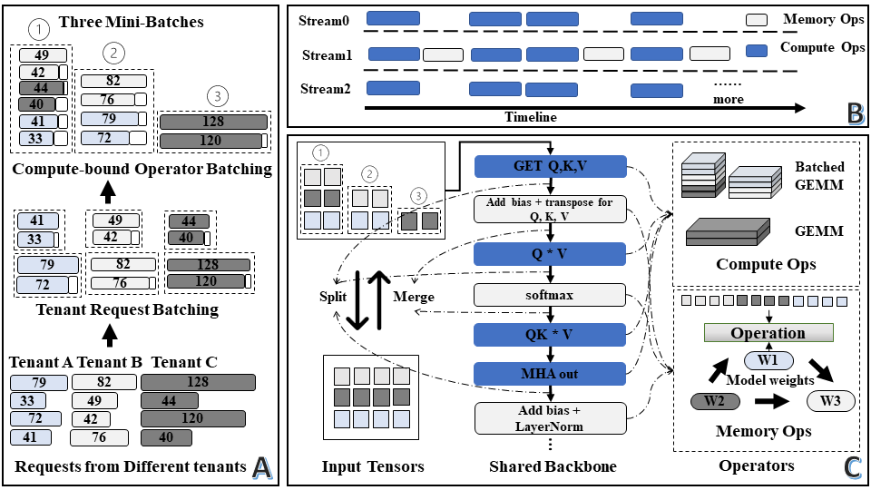

# ITIF: Integrated Transformers Inference Framework

## Overview

The Integrated Transformers Inference Framework (ITIF) is designed to address the challenges associated with GPU utilization and system throughput in deep learning applications that rely on Transformer models. ITIF allows multiple tenants to share a single backbone Transformer model on a single GPU, thereby optimizing resource management and improving overall performance.

This repository contains the source code, documentation, and examples of ITIF, a groundbreaking framework aimed at improving the efficiency of deep learning, particularly for large-scale cloud providers hosting numerous models with a shared backbone.

## Key Features

- Shared backbone for multi-tenant Transformer models
- Improved GPU utilization and system throughput
- Up to 2.40× performance improvement compared to baselines
- Applicable to a wide range of deep learning applications, including NLP and computer vision


## Architecture



This is the workflow of ITIF, here is the three main parts in ITIF:
- Two-Stage Batching Strategy By Request Handler 
- GEMM Scheduler deploys the Operators into CUDA Streams 
- Operator level Optimization Methods in Inference Runtime

## Quick Start

Because our implementation is based on the FasterTransformer, we keep the docs from the FasterTransformer. 

Firstly, you should compile it first, you can follow the guide in the [Bert_guide.md](docs/bert_guide.md) to compile the whole project.

Then you need go to our [example](examples/cpp/ITIF_example/) to use ITIF. We provides some base models as the example to evaluation our methods, here is the example:
```
./bin/bert_albert batch_size num_layers seq_len head_num size_per_head num_models
```
You can modify the parameters to choose the model type (Bert or Albert). By change the num_models, you can decide the number of tenants in the system.
We also keep our baseline construction, [MPS](examples/cpp/ITIF_example/mps.cc) and [Multi-Stream](examples/cpp/ITIF_example/multistream.cc). They are all the FasterTransformer based.